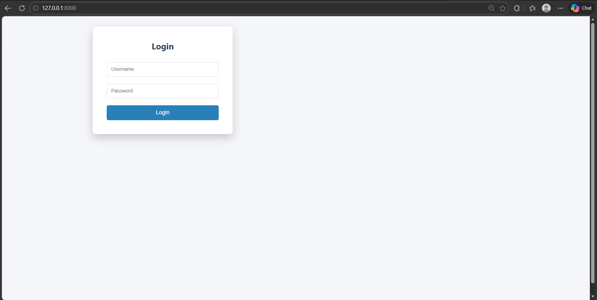
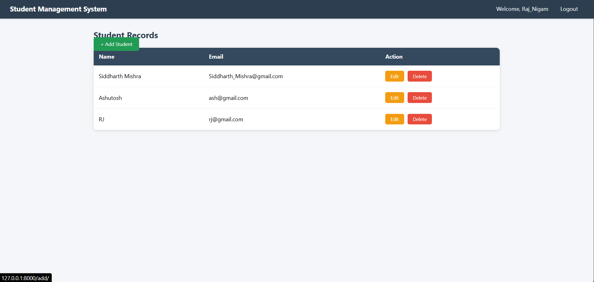

# 🚀 Django Login & CRUD Project

A simple and powerful Django project that includes user authentication and full CRUD functionality.

---

## ✨ Features
- 🔐 User Login System
- ➕ Create Data
- 📖 Read/View Data
- ✏️ Update Data
- ❌ Delete Data
- 🔍 Search Functionality
- 🚪 Logout System

---

## 🛠️ Tech Stack
- Python
- Django
- SQLite

---

## ⚙️ Setup & Run

### 1. Clone the repository
git clone https://github.com/rajcseaiml1234-eng/Django-Login.git

### 2. Navigate to project folder
cd Django-Login

### 3. Install dependencies
pip install django

### 4. Run migrations
python manage.py makemigrations  
python manage.py migrate  

### 5. Start server
python manage.py runserver

---

## 🌐 Access
Open browser and go to:
http://127.0.0.1:8000/

---

## 📌 Notes
- Default database: SQLite
- Do not upload `.env` or sensitive data
- Use virtual environment for better practice

---

## 👨‍💻 Author
Raj_Nigam

---

## ⭐ Support
If you like this project, give it a ⭐ on GitHub!

---
## Demo
## 📸 Screenshots

### 🔐 Login Page

### 📊 Dashboard

